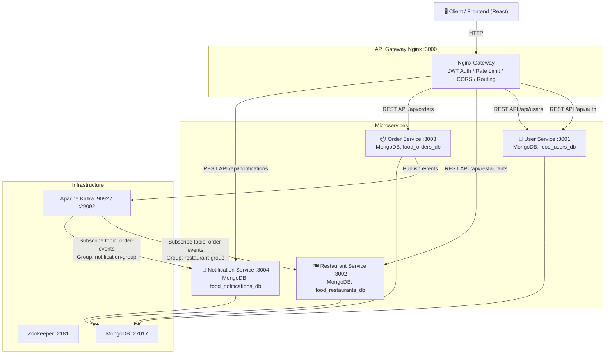

# FoodDash — Nền tảng Đặt Đồ Ăn Thông Minh & Kiến Trúc Microservices Hướng Sự Kiện Cấp Doanh Nghiệp

FoodDash là một hệ thống đặt đồ ăn trực tuyến cấp doanh nghiệp (enterprise-grade), được xây dựng trên kiến trúc microservices phân tán hướng sự kiện (Event-Driven Architecture). Hệ thống tự động hóa toàn bộ luồng nghiệp vụ từ lúc khách hàng đặt món, đồng bộ trừ/hoàn kho thời gian thực, gửi thông báo đa kênh và bảo mật phân quyền nghiêm ngặt. 

FoodDash sử dụng RESTful APIs đồng bộ thông qua API Gateway cho các luồng nghiệp vụ chặn và Apache Kafka cho các luồng giao tiếp bất đồng bộ ổn định, bền bỉ giữa các dịch vụ phân tán.

---

## 🏗 Kiến trúc hệ thống & Hợp đồng Sự kiện (Event Contracts)

Hệ thống gồm 5 thành phần chính và các hạ tầng bổ trợ giao tiếp bất đồng bộ thông qua Apache Kafka và đồng bộ qua Nginx API Gateway.



### Hợp đồng Sự kiện bất đồng bộ (Apache Kafka - Topic: `order-events`)
* **`ORDER_CREATED`**: Được phát đi bởi `Order Service` khi khách hàng đặt đơn hàng thành công.
  * *Restaurant Service* tiêu thụ (consume) để tự động trừ kho (stock) của món ăn.
  * *Notification Service* tiêu thụ để tạo và phát thông báo thời gian thực cho khách hàng: "Đơn hàng mới được tạo thành công".
* **`ORDER_STATUS_CHANGED`**: Được phát đi bởi `Order Service` khi chủ nhà hàng cập nhật trạng thái đơn (từ PENDING sang CONFIRMED, PREPARING, DELIVERING, DELIVERED).
  * *Notification Service* tiêu thụ để gửi thông báo cập nhật trạng thái thời gian thực cho khách hàng.
* **`ORDER_CANCELLED`**: Được phát đi khi đơn hàng bị hủy bởi khách hàng hoặc hệ thống.
  * *Restaurant Service* tiêu thụ để tự động hoàn lại số lượng kho cho món ăn.
  * *Notification Service* tiêu thụ để gửi thông báo hủy đơn tới người dùng.

### Cơ chế chịu lỗi & Dead Letter Queue (DLQ) (Mục 5.4)
Để đối phó với sự cố mạng và tránh làm nghẽn luồng của Stream chính:
* **Manual Commit Offset**: Consumer chỉ thực hiện commit offset thủ công lên Kafka khi luồng nghiệp vụ ghi vào database phía dưới hoàn tất thành công (tương đương cơ chế `XACK` trong Redis Streams).
* **Retry Backoff Loop**: Nếu xảy ra lỗi, hệ thống không commit và tự động thử lại tin nhắn đó 3 lần với thời gian trễ tăng dần để đối phó các lỗi kết nối tạm thời.
* **DLQ Routing**: Sau 3 lần thử lại thất bại, tin nhắn lỗi kèm stack trace sẽ được tự động đẩy sang hàng đợi chết **`order-events:dlq`** để khôi phục sau và giải phóng cho stream chính tiếp tục chạy.

---

## 🛠 Bảng Tổng quan Công nghệ (Tech Stack)

| Dịch vụ | Công nghệ / Framework | Vai trò chính | Port (Nội bộ) | Port (Host) |
| :--- | :--- | :--- | :--- | :--- |
| **Web Client** | React, Vite, TS, Vanilla CSS | Giao diện người dùng & Dashboard Admin/Owner | `80` | `80` |
| **API Gateway** | Nginx | Rate-limiting, CORS, định tuyến reverse proxy | `80` | `3000` |
| **User Service** | Node.js, Express, Mongoose | Quản lý xác thực, profile và quyền Admin | `3001` | `3001` |
| **Restaurant Service** | Node.js, Express, Mongoose, KafkaJS | Quản lý cửa hàng, thực đơn và đồng bộ kho hàng | `3002` | `3002` |
| **Order Service** | Node.js, Express, Mongoose, KafkaJS | Quản lý đặt hàng, trạng thái và phát sự kiện Kafka | `3003` | `3003` |
| **Notification Service** | Node.js, Express, Mongoose, KafkaJS | Tiêu thụ sự kiện Kafka để gửi thông báo thời gian thực | `3004` | `3004` |
| **MongoDB** | mongo:7 (Official Image) | Hệ cơ sở dữ liệu NoSQL cho toàn bộ hệ thống | `27017` | `27017` |
| **Kafka Broker** | confluentinc/cp-kafka:7.5.0 | Hạ tầng Message Broker truyền nhận sự kiện phân tán | `29092` | `9092` |

---

## 🚀 Hướng dẫn Khởi động Nhanh (Quick Start)

### Yêu cầu trước khi chạy (Prerequisites)
* **Docker** và **Docker Compose** phiên bản mới nhất phải được bật và đang chạy.
* Trình duyệt web bất kỳ (Chrome, Safari, Edge).

### Các bước khởi động hệ thống
1. **Truy cập thư mục dự án**:
   ```bash
   cd c:/Users/Admin/Documents/HTPT
   ```
2. **Khởi động toàn bộ cụm hệ thống (Detached Mode)**:
   ```bash
   docker compose up -d --build
   ```
3. **Kiểm tra sức khỏe hệ thống**:
   Xác nhận tất cả 10 container (bao gồm cả Zookeeper, Kafka, Mongo Express) đều đang ở trạng thái khỏe mạnh (`healthy` / `Up`):
   ```bash
   docker compose ps
   ```

---

## 📋 Tham chiếu Biến Môi trường (.env Reference)

Dưới dự án có sẵn file cấu hình `.env` chung được sử dụng bởi các container Docker:

| Biến | Mô tả | Ví dụ mặc định |
| :--- | :--- | :--- |
| `JWT_SECRET` | Khóa bí mật dùng để ký và xác thực token JWT của user | `food-ordering-jwt-secret-key-2024` |
| `MONGODB_URI` | Chuỗi kết nối MongoDB nội bộ (mỗi service sẽ dùng riêng biệt database) | `mongodb://mongodb:27017` |
| `KAFKA_BROKERS` | Địa chỉ máy chủ Kafka nội bộ trong mạng Docker | `kafka:29092` |

---

## 📖 Tài liệu đặc tả hệ thống API (API Documentation)

API Gateway Nginx dùng cổng tập trung `3000` để điều phối yêu cầu. Dưới đây là bảng đặc tả API:

### 1. Gateway Service
* `GET /health`: Kiểm tra trạng thái API Gateway và các dịch vụ phía dưới.

### 2. Auth & User Service
* `POST /api/auth/register`: Đăng ký tài khoản người dùng mới.
* `POST /api/auth/login`: Đăng nhập vào hệ thống và lấy JWT Token.
* `GET /api/users/profile`: Lấy profile của user hiện tại (Auth required).
* `PUT /api/users/profile`: Cập nhật thông tin cá nhân (Auth required).
* `GET /api/users`: Lấy toàn bộ người dùng (Admin only).
* `DELETE /api/users/:id`: Xóa tài khoản người dùng (Admin only).

### 3. Restaurant Service
* `GET /api/restaurants`: Lấy danh sách nhà hàng đang hoạt động (Public).
* `POST /api/restaurants`: Tạo nhà hàng mới (Owner only).
* `PUT /api/restaurants/:id`: Cập nhật thông tin nhà hàng (Owner / Admin).
* `GET /api/restaurants/:id/menu`: Lấy thực đơn nhà hàng (Public).
* `POST /api/restaurants/:id/menu`: Thêm món ăn vào thực đơn (Owner only).

### 4. Order Service
* `POST /api/orders`: Khách hàng tạo đơn hàng mới (Auth required).
* `GET /api/orders`: Lấy lịch sử đơn hàng của khách hàng hiện tại (Auth required).
* `PUT /api/orders/:id/status`: Cập nhật trạng thái đơn hàng (Owner / Admin).

### 5. Notification Service
* `GET /api/notifications`: Lấy danh sách thông báo của người dùng (Auth required).
* `PUT /api/notifications/:id/read`: Đánh dấu thông báo là đã đọc (Auth required).

---

## 🧪 Hướng dẫn Chạy kiểm thử (Testing Guide)

Hệ thống tích hợp sẵn 2 kịch bản kiểm thử tự động hóa E2E (End-to-End Regression) và bảo mật rất mạnh mẽ.

### 1. Kịch bản kiểm thử luồng nghiệp vụ tích hợp (`full-flow.test.js`)
Mở terminal và chạy lệnh để giả lập toàn bộ luồng từ: Đăng ký -> Đăng nhập -> Tạo nhà hàng -> Thêm món -> Đặt hàng -> **Kafka tự động trừ kho** -> Thay đổi trạng thái đơn -> Hủy đơn -> **Kafka tự động hoàn kho** -> Verification:
```bash
cd tests && npm install && node integration/full-flow.test.js
```

### 2. Kịch bản kiểm thử xác thực & phân quyền bảo mật (`auth-flow.test.js`)
Kiểm tra tính năng phân quyền (Customer không thể truy cập API của Admin, JWT Token hết hạn tự động bị chặn bởi Gateway):
```bash
cd tests && node integration/auth-flow.test.js
```

---

## 📈 Tính năng Giám sát & Ghi Nhật ký (Logging & Resiliency Logs)

Hệ thống áp dụng kiểu logging đa tầng ở cấp độ doanh nghiệp:
* **Real-time Console Logs**: Bắt và đọc nhanh thông tin bằng lệnh `docker compose logs -f [service-name]`.
* **Central Winston File Logs**: Logs được ghi nhận và ghi đè bền bỉ trong container tại:
  * `/usr/src/app/logs/error.log`: Lưu vết lỗi cục bộ để phục vụ debug.
  * `/usr/src/app/logs/combined.log`: Ghi nhận toàn bộ thông tin hoạt động chung của hệ thống phân tán.
* **Database Startup Resilience**: Khi MongoDB của hệ thống khởi động trễ hơn, các Microservices sẽ tự động nhận diện, ghi logs và thử kết nối lại 5 lần mỗi 5 giây giúp hệ thống khởi động thực tế rất ổn định và không bị sập đổ.
