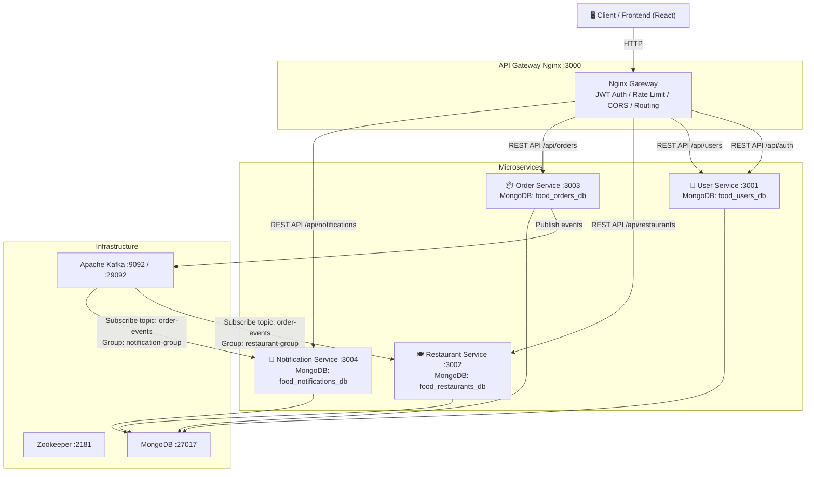

# SunStack — Enterprise-Grade Intelligent Food Ordering & Event-Driven Microservices Platform

SunStack la mot he thong dat do an truc tuyen o cap do doanh nghiep (enterprise-grade), duoc xay dung tren kien truc microservices phan tan huong su kien (Event-Driven Architecture). He thong tu dong hoa toan bo luong nghiep vu tu luc khach hang dat mon, dong bo tru/hoan kho thoi gian thuc, gui thong bao da kenh va bao mat phan quyen nghiem ngat. 

SunStack su dung RESTful APIs dong bo thong qua API Gateway cho cac luong nghiep vu chan va Apache Kafka cho cac luong giao tiep bat dong bo on dinh, ben bi giua cac dich vu phan tan.

---

## 🏗 Kien truc he thong & Hop dong Su kien (Event Contracts)

He thong gom 5 thanh phan chinh va cac ha tang bo tro giao tiep bat dong bo thong qua Apache Kafka va dong bo qua Nginx API Gateway.



### Hop dong Su kien bat dong bo (Apache Kafka - Topic: `order-events`)
* **`ORDER_CREATED`**: Duoc phat di boi `Order Service` khi khach hang dat don hang thanh cong.
  * *Restaurant Service* tieu thu (consume) de tu dong tru kho (stock) cua mon an.
  * *Notification Service* tieu thu de tao va phat thong bao thoi gian thuc cho khach hang: "Don hang moi duoc tao thanh cong".
* **`ORDER_STATUS_CHANGED`**: Duoc phat di boi `Order Service` khi chu nha hang cap nhat trang thai don (tu PENDING sang CONFIRMED, PREPARING, DELIVERING, DELIVERED).
  * *Notification Service* tieu thu de gui thong bao cap nhat trang thai thoi gian thuc cho khach hang.
* **`ORDER_CANCELLED`**: Duoc phat di khi don hang bi huy boi khach hang hoac he thong.
  * *Restaurant Service* tieu thu de tu dong hoan lai so luong kho cho mon an.
  * *Notification Service* tieu thu de gui thong bao huy don toi nguoi dung.

### Co che chiu loi & Dead Letter Queue (DLQ) (Muc 5.4)
De doi pho voi su co mang va tranh lam nghen luong cua Stream chinh:
* **Manual Commit Offset**: Consumer chi thuc hien commit offset thu cong len Kafka khi luong nghiep vu ghi vao database phia duoi hoan tat thanh cong (tuong duong co che `XACK` trong Redis Streams).
* **Retry Backoff Loop**: Neu xay ra loi, he thong khong commit va tu dong thu lai tin nhan do 3 lan voi thoi gian tre tang dan de doi pho cac loi ket noi tam thoi.
* **DLQ Routing**: Sau 3 lan thu lai that bai, tin nhan loi kem stack trace se duoc tu dong day sang hang doi chet **`order-events:dlq`** de khoi phuc sau va giai phong cho stream chinh tiep tuc chay.

---

## 🛠 Bang Tong quan Cong nghe (Tech Stack)

| Dich vu | Cong nghe / Framework | Vai tro chinh | Port (Internal) | Port (Host) |
| :--- | :--- | :--- | :--- | :--- |
| **Web Client** | React, Vite, TS, Vanilla CSS | Giao dien nguoi dung & Dashboard Admin/Owner | `80` | `80` |
| **API Gateway** | Nginx | Rate-limiting, CORS, dinh tuyen reverse proxy | `80` | `3000` |
| **User Service** | Node.js, Express, Mongoose | Quan ly xac thuc, profile va quyen Admin | `3001` | `3001` |
| **Restaurant Service** | Node.js, Express, Mongoose, KafkaJS | Quan ly cua hang, thuc don va dong bo kho hang | `3002` | `3002` |
| **Order Service** | Node.js, Express, Mongoose, KafkaJS | Quan ly dat hang, trang thai va phat su kien Kafka | `3003` | `3003` |
| **Notification Service** | Node.js, Express, Mongoose, KafkaJS | Tieu thu su kien Kafka de gui thong bao thoi gian thuc | `3004` | `3004` |
| **MongoDB** | mongo:7 (Official Image) | He co so du lieu NoSQL cho toan bo he thong | `27017` | `27017` |
| **Kafka Broker** | confluentinc/cp-kafka:7.5.0 | Ha tang Message Broker truyen nhan su kien phan tan | `29092` | `9092` |

---

## 🚀 Huong dan Khoi dong Nhanh (Quick Start)

### Yeu cau truoc khi chay (Prerequisites)
* **Docker** va **Docker Compose** phien ban moi nhat phai duoc bat va dang chay.
* Trinh duyet web bat ky (Chrome, Safari, Edge).

### Cac buoc khoi dong he thong
1. **Truy cap thu muc du an**:
   ```bash
   cd c:/Users/Admin/Documents/HTPT
   ```
2. **Khoi dong toan bo cum he thong (Datached Mode)**:
   ```bash
   docker compose up -d --build
   ```
3. **Kiem tra suc khoe he thong**:
   Xac nhan tat ca 10 container (bao gom ca Zookeeper, Kafka, Mongo Express) deu dang o trang thai khoe manh (`healthy` / `Up`):
   ```bash
   docker compose ps
   ```

---

## 📋 Tham chieu Bien Moi truong (.env Reference)

Duoi du an co san file cau hinh `.env` chung duoc su dung boi cac container Docker:

| Bien | Mo ta | Vi du mac dinh |
| :--- | :--- | :--- |
| `JWT_SECRET` | Khoa bi mat dung de ky va xac thuc token JWT cua user | `food-ordering-jwt-secret-key-2024` |
| `MONGODB_URI` | Chuoi ket noi MongoDB noi bo (moi service se dung rieng biet database) | `mongodb://mongodb:27017` |
| `KAFKA_BROKERS` | Dia chi may chu Kafka noi bo trong mang Docker | `kafka:29092` |

---

## 📖 Tai lieu dac ta he thong API (API Documentation)

API Gateway Nginx dung cong tap trung `3000` de dieu phoi yeu cau. Duoi day la bang dac ta API:

### 1. Gateway Service
* `GET /health`: Kiem tra trang thai API Gateway va cac dich vu phia duoi.

### 2. Auth & User Service
* `POST /api/auth/register`: Dang ky tai khoan nguoi dung moi.
* `POST /api/auth/login`: Dang nhap vao he thong va lay JWT Token.
* `GET /api/users/profile`: Lay profile cua user hien tai (Auth required).
* `PUT /api/users/profile`: Cap nhat thong tin ca nhan (Auth required).
* `GET /api/users`: Lay toan bo nguoi dung (Admin only).
* `DELETE /api/users/:id`: Xoa tai khoan nguoi dung (Admin only).

### 3. Restaurant Service
* `GET /api/restaurants`: Lay danh sach nha hang dang hoat dong (Public).
* `POST /api/restaurants`: Tao nha hang moi (Owner only).
* `PUT /api/restaurants/:id`: Cap nhat thong tin nha hang (Owner / Admin).
* `GET /api/restaurants/:id/menu`: Lay thuc don nha hang (Public).
* `POST /api/restaurants/:id/menu`: Them mon an vao thuc don (Owner only).

### 4. Order Service
* `POST /api/orders`: Khach hang tao don hang moi (Auth required).
* `GET /api/orders`: Lay lich su don hang cua khach hang hien tai (Auth required).
* `PUT /api/orders/:id/status`: Cap nhat trang thai don hang (Owner / Admin).

### 5. Notification Service
* `GET /api/notifications`: Lay danh sach thong bao cua nguoi dung (Auth required).
* `PUT /api/notifications/:id/read`: Danh dau thong bao la da doc (Auth required).

---

## 🧪 Huong dan Chay kiem thu (Testing Guide)

He thong tich hop san 2 kịch ban kiem thu tu dong hoa E2E (End-to-End Regression) va bao mat rat manh me.

### 1. Kich ban kiem thu luong nghiep vu tich hop (`full-flow.test.js`)
Mo terminal va chay lenh de gia lap toan bo luong tu: Dang ky -> Dang nhap -> Tao nha hang -> Them mon -> Dat hang -> **Kafka tu dong tru kho** -> Thay doi trang thai don -> Huy don -> **Kafka tu dong hoan kho** -> Verification:
```bash
cd tests && npm install && node integration/full-flow.test.js
```

### 2. Kich ban kiem thu xac thuc & phan quyen bao mat (`auth-flow.test.js`)
Kiem tra tinh nang phan quyen (Customer khong the truy cap API cua Admin, JWT Token het han tu dong bi chan boi Gateway):
```bash
cd tests && node integration/auth-flow.test.js
```

---

## 📈 Tinh nang Giam sat & Ghi Nhat ky (Logging & Resiliency Logs)

He thong ap dung kieu logging da tang o cap do doanh nghiep:
* **Real-time Console Logs**: Bat va doc nhanh thong tin bang lenh `docker compose logs -f [service-name]`.
* **Central Winston File Logs**: Logs duoc ghi nhan va ghi de ben bi trong container tai:
  * `/usr/src/app/logs/error.log`: Luu vet loi cuc bo de phuc vu debug.
  * `/usr/src/app/logs/combined.log`: Ghi nhan toan bo thong tin hoat dong chung cua he thong phan tan.
* **Database Startup Resilience**: Khi MongoDB cua he thong khoi dong tre hon, cac Microservices se tu dong nhan dien, ghi logs va thu ket noi lai 5 lan moi 5 giay giup he thong khoi dong thuc te rat on dinh va khong bi sap do.
